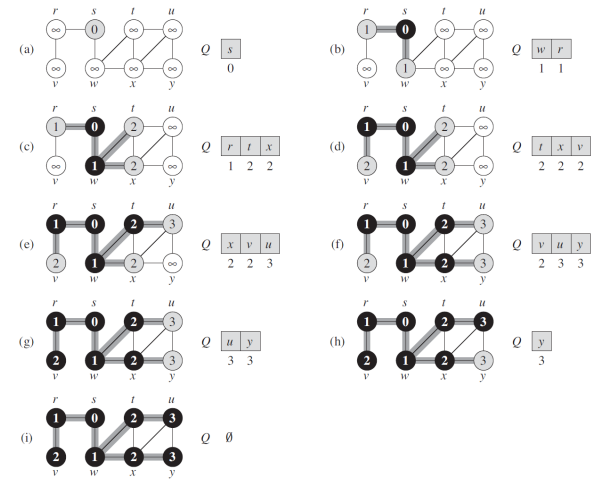
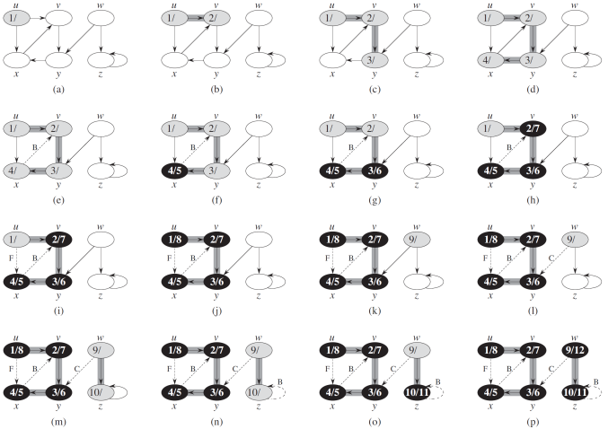
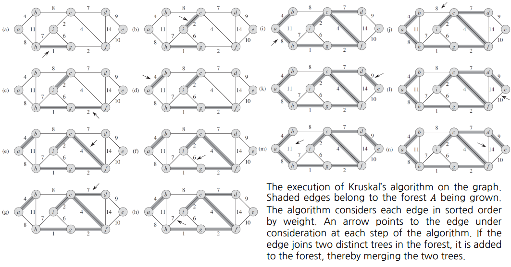
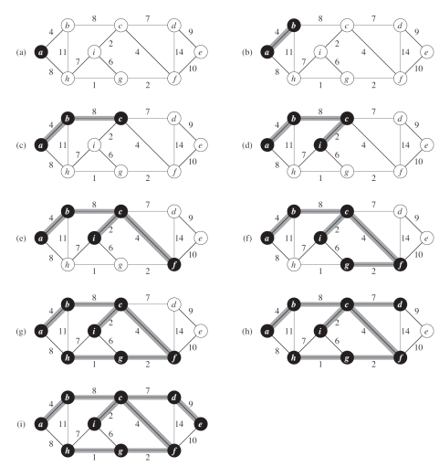
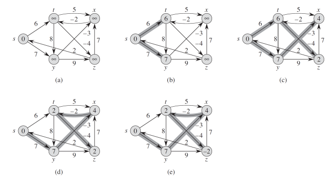
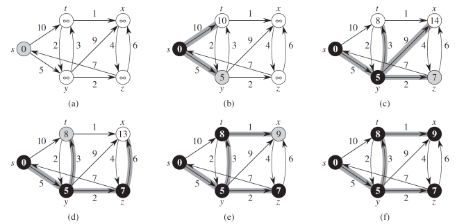

# Graph algorithm

Reference book: [Introduction to Algorithm, 3rd Edition](./https://www.amazon.com/Introduction-Algorithms-3rd-MIT-Press/dp/0262033844)

1. [BFS: Breath-First-Search](./bfs.py)

---
2. [DFS: Depth-First-Search](./dfs.py)

---
3. [MST: Minimum-Spanning-Tree](./mst.py)
* Kruscal's algorithm:

* Prim's algorithm:

---
4. [SP: Shortest-Path](./sp.py)
* Bellman-Ford algorithm:

* Dijkstra algorithm:
